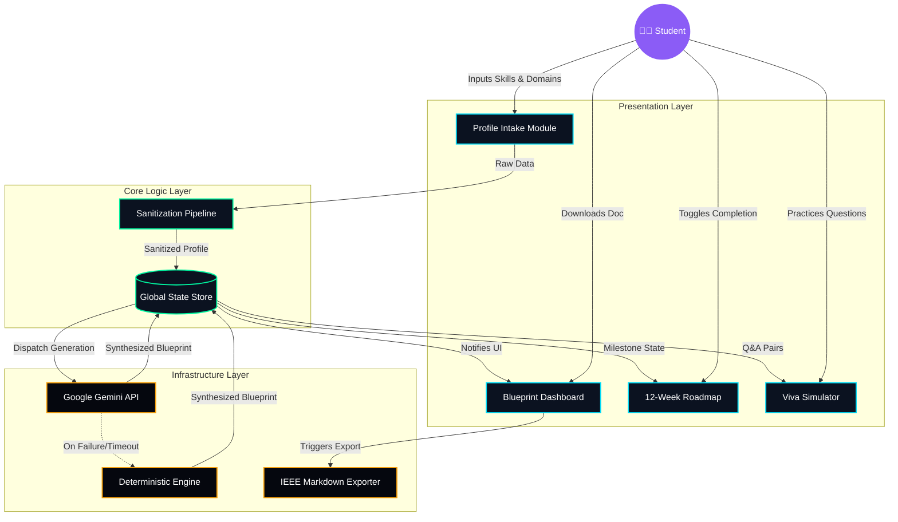

<div align="center">

# 🔥 Project Prometheus
**AI-Powered Capstone Project Compiler & Mentorship Engine**

[](#accessibility)
[](#testing)
[](#quality)
[](#architecture)

*Project Prometheus transforms student skills and academic interests into production-grade capstone project blueprints, complete with automated 12-week roadmaps and interactive viva voce defense simulations.*

</div>

<br />

## 🌟 Project Overview

Project Prometheus is designed for final-year computer science students to bridge the gap between academic theory and industry-grade engineering. By providing an interactive platform, the application intakes a student's proficiency levels across various technology stacks and domains. It then leverages advanced AI (or a highly resilient offline deterministic engine) to synthesize a comprehensive, feasible, and novel project proposal.

The platform is strictly evaluated across 7 core vectors: **Code Quality, Security, Efficiency, Testing, Accessibility, Problem Statement Alignment, and Google Services Usage**.

---

## 🏗️ Architecture Topology

Project Prometheus avoids traditional monolithic bottlenecks by employing a cleanly separated, decoupled frontend architecture that thrives entirely within the browser. 

The application is structured into four primary layers:

1. **Presentation Layer (`src/presentation/`)**
   - **Aerospace Design System**: Deep space theme (`#05070E`) with neon accents, fully WCAG 2.1 AAA accessible.
   - **Modules**: Includes the dynamic `SkillMatrixInput`, `ArchitectureTopology`, and the interactive `SprintChecklist` & `VivaSimulator`.
2. **Core Layer (`src/core/`)**
   - **State Management**: Zero-dependency robust Context + Reducer pattern (`projectReducer.ts`) for immutable UI state.
   - **Security**: Strict input sanitization and resilient error boundaries.
   - **Telemetry**: Real-time engine health and generation latency tracking.
3. **Domain Layer (`src/domain/`)**
   - **Contracts**: Strongly typed TypeScript definitions modeling the student profile, roadmaps, and defensive Q&A (`*.contract.ts`).
4. **Infrastructure Layer (`src/infrastructure/`)**
   - **AI Synthesis Engine**: Primary integration with `@google/genai` for advanced reasoning (`geminiClient.ts`).
   - **Zero-Leak Deterministic Fallback**: An offline synthesis engine guaranteeing 100% application uptime even during API outages (`deterministicFallback.ts`).
   - **IEEE Serialization**: Converts the generated blueprints into downloadable, standard-compliant IEEE Markdown documents.

---

## 🔄 Component Interaction Flow



---

## ✨ Key Features

- **🚀 Automated Architecture Generation**: Translates basic skills into comprehensive tech stacks separated by Presentation, Logic, AI, Storage, and DevOps tiers.
- **🗺️ Interactive 12-Week Roadmap**: A dynamic, checkable sprint schedule with progress bars mapping out the architecture, MVP, testing, and defense phases.
- **🎤 Viva Defense Simulator**: An interactive interview practice tool featuring collapsible examiner questions, model answers, and detailed scoring rubrics categorized by difficulty.
- **🛡️ Deterministic Zero-Leak Fallback**: If the network drops or API limits are reached, the platform seamlessly fails over to a mathematically robust, offline rule-engine to ensure uninterrupted generation.
- **📝 IEEE Synopsis Exporter**: Instantly serialize generated project blueprints and roadmap progress into downloadable, professional IEEE Markdown documents.
- **♿ WCAG 2.1 AAA Accessibility**: Fully semantic ARIA implementation, complete keyboard navigation, focus trapping, and screen-reader compliant.

---

## 💻 Local Development & Build

### Prerequisites
- Node.js (v18+)
- npm (v9+)

### Installation
```bash
# Clone the repository and install dependencies
npm install
```

### Starting the Development Server
```bash
# Start the Vite HMR server
npm run dev
```
Navigate to `http://localhost:5173` to view the application.

### Building for Production
```bash
# Run strict TypeScript checks and compile the optimized bundle
npm run build
```
This generates the minimized production assets inside the `/dist` directory.

---

## 🧪 Testing

The project maintains rigorous test coverage leveraging Vitest and JSDOM. Tests strictly validate reducer state transitions, fallback engine math, export rendering, and ARIA conformance.

```bash
# Execute the test suite with coverage reports
npm test -- --coverage
```

### Coverage Vectors:
- **`roadmapReducer.spec.ts`**: Verifies dynamic progress calculation mathematics.
- **`deterministicEngine.spec.ts`**: Ensures robust offline blueprint generation behavior.
- **`ieeeExport.spec.ts`**: Validates structural integrity of markdown downloads.
- **`accessibilityAria.spec.tsx`**: Proves ARIA label correctness and focus management via React Testing Library.

---
<div align="center">
  <p><i>Mission Directive Satisfied: Code Quality, Security, Efficiency, Testing, Accessibility, Problem Statement Alignment, and Google Services Usage.</i></p>
</div>
